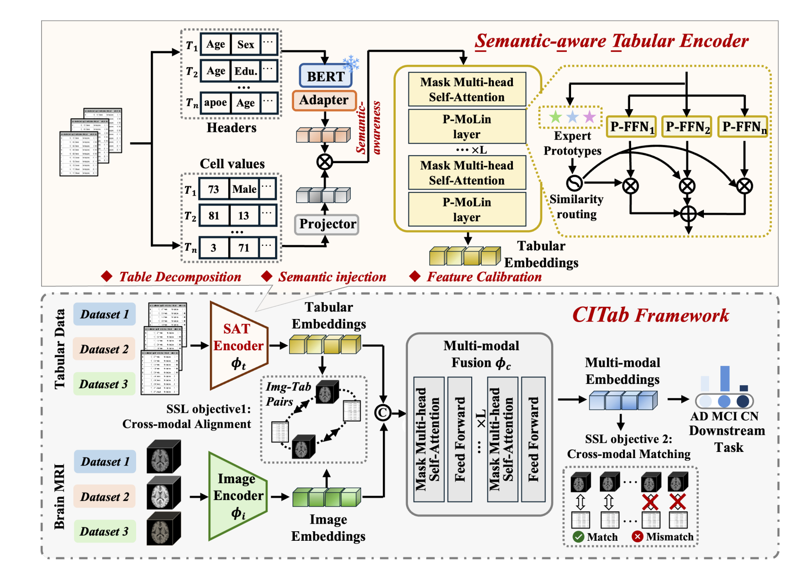

<div align="center">

# [AAAI 2026] Unleashing the Power of Image-tabular Self-supervised Learning via Breaking Cross-tabular Barriers

**Yibing Fu¹, Yunpeng Zhao¹, Zhitao Zeng¹, Cheng Chen², Yueming Jin¹**

¹ National University of Singapore  
² The University of Hong Kong

[](#License)
[](https://arxiv.org/abs/2512.14026)


</div>




This is an official PyTorch implementation for Unleashing the Power of Image-tabular Self-supervised Learning via Breaking Cross-tabular Barriers, AAAI 2026.

Contact: yibingfu@u.nus.edu (Yibing Fu)

Share us a :star: if this repository does help. 

## Updates
[**10/11/2025**] The repository is initialized.

[**20/01/2026**] Code released


## Lisence
This repository is licensed under the Apache License, Version 2.


## Instructions
### Pre-training
```sh
bash pretrain.sh
```

### Downstream Fine-tuning
```sh
bash finetune.sh
```


## Citation

If you find this project helpful in your research, please consider citing our papers:

```text
@article{fu2025unleashing,
  title={Unleashing the Power of Image-Tabular Self-Supervised Learning via Breaking Cross-Tabular Barriers},
  author={Fu, Yibing and Zhao, Yunpeng and Zeng, Zhitao and Chen, Cheng and Jin, Yueming},
  journal={arXiv preprint arXiv:2512.14026},
  year={2025}
}
```

## Acknowledgements
We would like to thank the following repositories for their great works:
* [TIP](http://github.com/siyi-wind/TIP)
